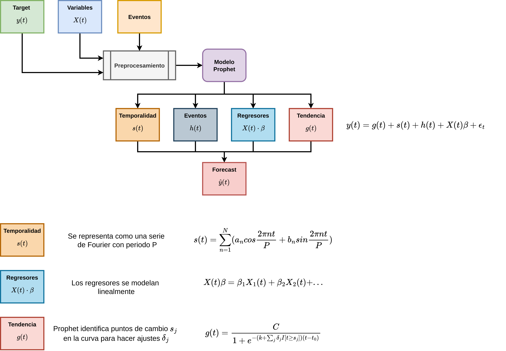
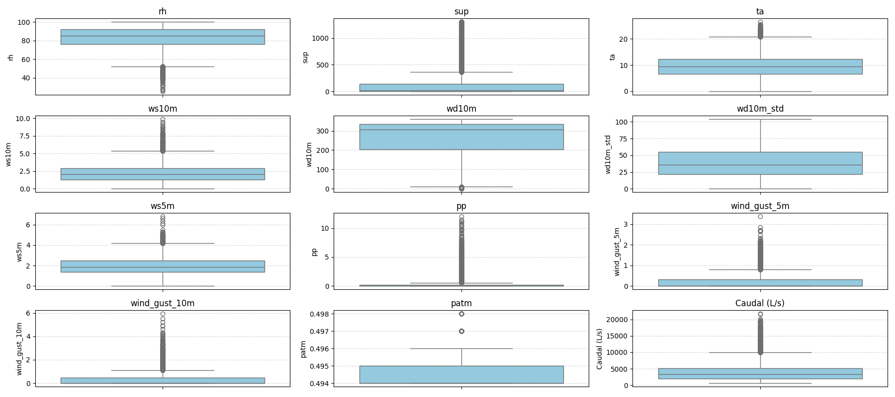

# Mowi Caudal Forecast

Pipeline de pronóstico de caudal utilizando Prophet (Facebook) con regresores externos. Este proyecto genera pronósticos diarios de caudal con un horizonte de 15 días, utilizando datos meteorológicos y mediciones históricas.

## 📊 Descripción

Este proyecto implementa un modelo de pronóstico de caudal basado en Prophet, que combina:
- **Datos meteorológicos** (variables exógenas/regresores)
- **Mediciones históricas de caudal** (variable objetivo)
- **Componentes estacionales** (semanal y anual)

El modelo genera pronósticos diarios con intervalos de confianza y métricas de evaluación.

## 🏗️ Arquitectura del Modelo



El diagrama muestra el flujo completo del pipeline, desde la carga de datos hasta la generación de pronósticos.

## 📈 Distribución de Variables



Este gráfico muestra la distribución de las variables de entrada (regresores) y salida (caudal objetivo) utilizadas en el modelo.

## 🚀 Instalación

### Requisitos

- Python 3.7+
- pip

### Dependencias

```bash
pip install pandas numpy prophet matplotlib scikit-learn
```

O instala desde un archivo `requirements.txt` (si existe):

```bash
pip install -r requirements.txt
```

## 📁 Estructura del Proyecto

```
mowi-caudal-forecast/
├── prophet_caudal_pipeline.py    # Pipeline principal
├── df_x_concatenated.csv         # Datos meteorológicos (entrada)
├── df_y_concatenated.csv         # Mediciones de caudal (entrada)
├── prophet_diagram.png           # Diagrama del modelo
├── var_dist.png                  # Distribución de variables
├── output/                        # Directorio de salidas
│   ├── caudal_forecast_daily.csv # Pronósticos generados
│   ├── forecast_vs_history.png   # Gráfico pronóstico vs histórico
│   ├── prophet_components.png    # Componentes del modelo
│   └── forecast_closeup_90d.png  # Vista detallada últimos 90 días
└── backup/                       # Archivos de respaldo
```

## ⚙️ Configuración

El pipeline se puede configurar modificando las variables en la sección `CONFIG` del archivo `prophet_caudal_pipeline.py`:

```python
TARGET_COL = 'pp'                    # Columna objetivo (caudal)
TIMESTAMP_COL = 'timestamp'          # Columna de timestamps
FORECAST_HORIZON_DAYS = 15          # Días de pronóstico
MIN_DATE = pd.Timestamp("2022-02-01") # Fecha mínima de datos
future_regressor_strategy = 'linear' # Estrategia para regresores futuros
```

## 🎯 Uso

1. **Preparar los datos de entrada:**
   - `df_x_concatenated.csv`: Datos meteorológicos con columna `timestamp`
   - `df_y_concatenated.csv`: Mediciones de caudal con columna `Fecha`

2. **Ejecutar el pipeline:**
   ```bash
   python prophet_caudal_pipeline.py
   ```

3. **Resultados:**
   - Los pronósticos se guardan en `output/caudal_forecast_daily.csv`
   - Los gráficos se generan en el directorio `output/`

## 📊 Salidas

El pipeline genera:

- **Pronósticos CSV**: `output/caudal_forecast_daily.csv` con columnas:
  - `ds`: Fecha del pronóstico
  - `yhat`: Valor pronosticado
  - `yhat_lower`: Límite inferior del intervalo de confianza
  - `yhat_upper`: Límite superior del intervalo de confianza

- **Gráficos**:
  - `forecast_vs_history.png`: Comparación del pronóstico con datos históricos
  - `prophet_components.png`: Descomposición de componentes (tendencia, estacionalidad)
  - `forecast_closeup_90d.png`: Vista detallada de los últimos 90 días

## 📈 Métricas

El modelo calcula automáticamente las siguientes métricas:
- **RMSE** (Root Mean Squared Error)
- **MAE** (Mean Absolute Error)
- **MAPE** (Mean Absolute Percentage Error)
- **R²** (Coeficiente de determinación)

## 🔧 Características del Modelo

- **Estacionalidad**: Semanal y anual
- **Regresores externos**: Variables meteorológicas como regresores
- **Capacidad de crecimiento**: Límites superior (cap) e inferior (floor) configurados
- **Manejo de datos faltantes**: Interpolación y relleno de valores faltantes

## 📝 Notas

- Los datos se agregan a nivel diario antes de entrenar el modelo
- El modelo utiliza todos los datos disponibles desde `MIN_DATE` para el entrenamiento
- Los regresores futuros se proyectan usando la estrategia configurada (`linear` por defecto)

## 📄 Licencia

Este proyecto es propiedad de Agrospace.

## 👥 Contribuidores

Agrospace Team
